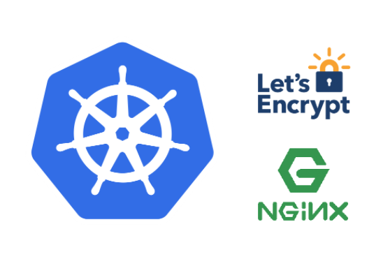
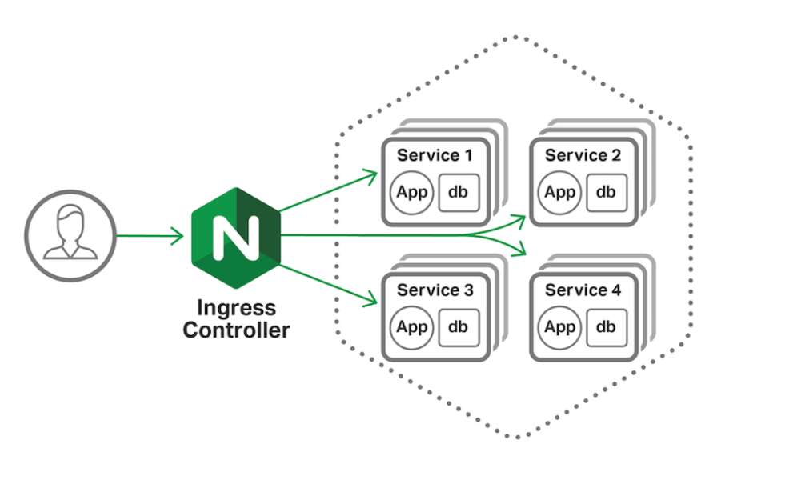
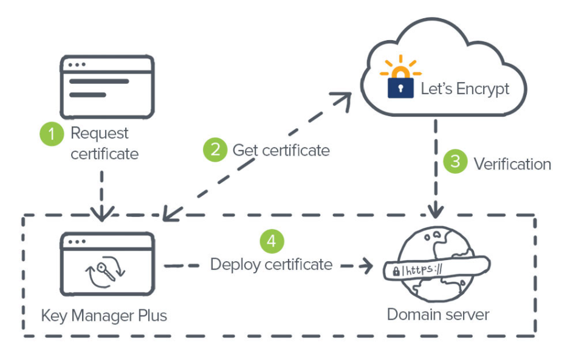

# k8s_helm

This post is intended to give a small starting guide for the installation of Nginx Controller and Cert Manager. 

In k8s environments we usually need an api manager as well as a service endpoint controller for our microservices deployed in k8s. In order for these to be accessible through endpoints, we will need a piece like Nginx (ingress controller). On the other hand, and in order to be able to access the microservices in a secure way, through the https (secure) protocol, a piece like Cert Manager is necessary, which will be in charge of generating and signing certificates through a service as it can be *letsencrypt*.  

As a requirement to be able to install the following components, it is necessary to have Helm version 3.

### Nginx setup

First of all, we must know if we have any namespace within our k8s dedicated to hosting this ingress controller / api manager. If not, it is highly recommended to create a namespace with the desired name (usually ingress, api or api-manager). To do this, we would simply perform the following command: 

```
$ kubectl create namespace ingress
namespace/ingress created
```

With this, we would have our namespace created and prepared to be able to deploy our ingress-controller. Now we will go to the own installation of the ingress-controller. In this case, our ingress controller will do the functions that we have described in the introduction, following a pattern like the one in the following diagram: 



In this guide, we will install our Nginx in a basic way through Helm's default values for nginx, since for this case no additional configuration is necessary. To do this, we must have helm installed on our machine, if it is from where we are going to launch helm, or install helm on the remote machine or similar, such as an azure devops step. To perform this helm installation task, please access the link in Annexes (1). With helm version 3 (or higher) installed, we move on to installing Nginx. For this we need to execute the following steps: 

1- Add the official nginx helm repository: 

```
$ helm repo add ingress-nginx https://kubernetes.github.io/ingress-nginx
$ helm repo update
```

2 - Install the inginx helm with the default values:   

```
$ helm install ingress-nginx ingress-nginx/ingress-nginx
```


3 - Check that the installation of the ingress has been carried out correctly: 

```
$ kubectl get pods -n ingress
NAME                                        READY   STATUS    RESTARTS   AGE
ingress-nginx-controller-57cb5bf694-kb9fk   1/1     Running   0          31s
```

**NOTES:**

Based on being able to use our ingress-controller correctly, we must include the ingress section in our micro services to be able to refer to this nginx class in them and that k8s treat the ingress from this deployed nginx. For this, an example of ingress that must be configured in the microservices is the following (each of the parameters would have to be adapted with the corresponding value): 

```
apiVersion: networking.k8s.io/v1beta1
kind: Ingress
metadata:
  annotations:
    kubernetes.io/ingress.class: nginx
  name: example
  namespace: foo
spec:
  rules:
    - host: www.example.com
      http:
        paths:
          - backend:
              serviceName: exampleService
              servicePort: 80
            path: /
  # This section is only required if TLS is to be enabled for the Ingress
  tls:
      - hosts:
          - www.example.com
        secretName: example-tls
```

In this guide we will use letsencrypt as a certificate signing tool, but we can always include a certificate in our ingress controller to be able to serve our https endpoints with that, for this, we must create a secret in the namespace where our microservice is located, and add the certificate in the base64-encoded tls.crt and tls.key sections.

```
apiVersion: v1
kind: Secret
metadata:
  name: example-tls
  namespace: foo
data:
  tls.crt: <base64 encoded cert>
  tls.key: <base64 encoded key>
type: kubernetes.io/tls
```

#### Cert Manager (Let's Encrypt) installation



Analogous to the previous case, we must know how to create a specific namespace for cert-manager. To do this, we must perform the following command:

```
#Create Namespace
$ kubectl create namespace cert-manager
```

After having the specific namespace created, we must install the helm repository:

```
#Helm cert-manager repo add
$ helm repo add jetstack https://charts.jetstack.io
$ helm repo update
```

Finally, we deploy Cert manager with the following command, using the default values:

```
#Helm install cert manager
$ helm install \
  cert-manager jetstack/cert-manager \
  --namespace cert-manager \
  --create-namespace \
  --version v1.3.1 \
  --set installCRDs=true
```

It should be noted that  the  version is v1.3.1.

Once deployed, we check that the pods are up:

```
#Kubectl status
$ kubectl get pods -n cert-manager
NAME                                       READY   STATUS    RESTARTS   AGE
cert-manager-7998c69865-7qgpb              1/1     Running   0          15s
cert-manager-cainjector-7b744d56fb-cgr5b   1/1     Running   0          15s
cert-manager-webhook-7d6d4c78bc-mqtmq      1/1     Running   0          15s
```

At this moment, we must make a point about Cert manager, and that is, cert manager needs a cluster-issuer to be able to sign the certificates autonomously. For this, in this guide, we are going to refer to letsencrypt used in an X project, we will use our own chart, created for this purpose.

```
#Helm issuer install
$ helm install --version 0.1.0 -f common.yaml -f production.yaml -n ingress issuer ./helm
```

Where the common.yaml and production.yaml files are the following:

```
acme:
  email: "email@email.com"
 
resources:
  requests:
    cpu: 10m
    memory: 32Mi
```

With this, we would have the cert-manager and the issuer deployed.

```
acme:
  privateKeySecretRef: X-project
```

